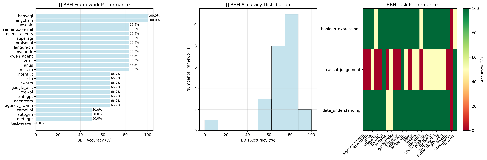
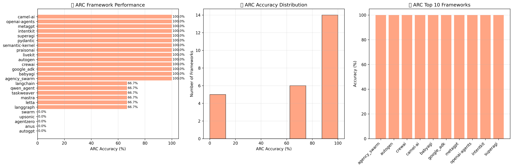
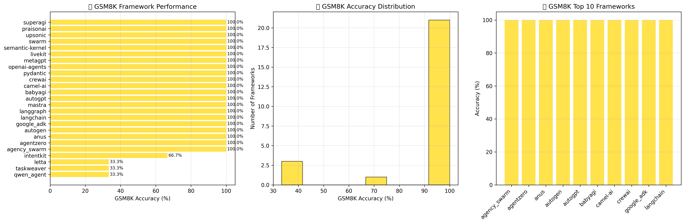
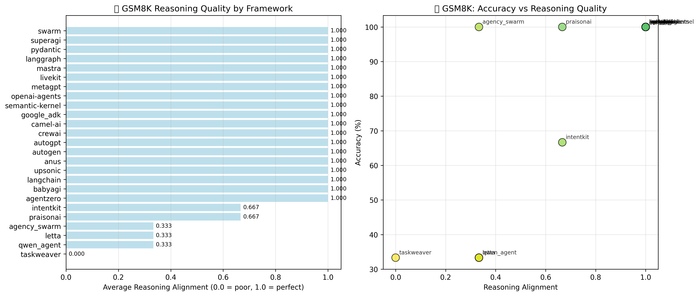
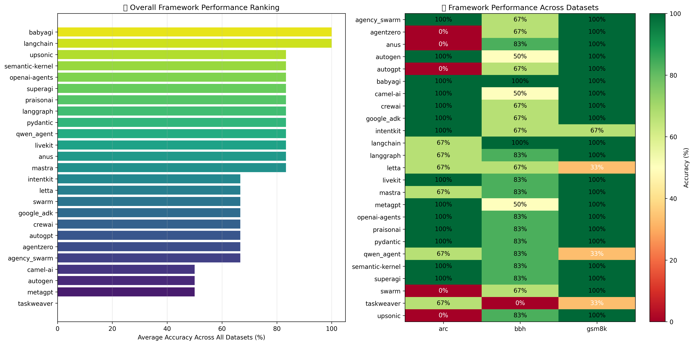

# Multi-Dataset Agentic Framework Evaluation

A dataset-agnostic benchmarking repository for evaluating multiple agentic AI frameworks across various reasoning datasets. This project enables systematic comparison of different agent architectures' reasoning capabilities through a modular, configuration-driven approach that supports multiple datasets including BBH, GSM8K, and ARC.

## 🎯 Performance Overview

### Multi-Dataset Analysis Results


**BBH (Big Bench Hard)**: Framework performance, accuracy distribution, and task-level heatmap across 23 challenging reasoning tasks.


**ARC (AI2 Reasoning Challenge)**: Framework performance and accuracy distribution across science reasoning questions.


**GSM8K (Grade School Math)**: Framework performance and accuracy distribution across mathematical word problems.


**GSM8K Reasoning Quality**: Analysis of reasoning alignment scores showing how well frameworks explain their mathematical reasoning.


**Cross-Dataset Comparison**: Overall framework rankings and performance heatmap across all three datasets.

📊 **[View complete interactive analysis in Jupyter notebook](analysis/analysis.ipynb)**

## Overview

This repository implements and evaluates **multiple agentic frameworks** across **various reasoning datasets** through a modular loader system. The evaluation supports datasets like BIG Bench Hard (BBH), Grade School Math 8K (GSM8K), and AI2 Reasoning Challenge (ARC), using configurable few-shot prompting and chain-of-thought reasoning to assess each framework's performance.

## Supported Frameworks

The following 21 agentic frameworks are implemented, with 20 currently active for evaluation:

| Framework | Status | Description |
|-----------|--------|-------------|
| **AgentZero** | ✅ Active | Dynamic framework leveraging OS as tool, emphasizing transparency and real-world automation |
| **Anus** | ✅ Active | Experimental lightweight agent framework for research and development |
| **AutoGen** | ✅ Active | Microsoft's conversational multi-agent framework with role-based collaboration and low-code studio |
| **CAMEL-AI** | ✅ Active | Communicative agents for "mind" exploration with role-playing and autonomous cooperation capabilities |
| **CrewAI** | ✅ Active | Enterprise-ready collaborative framework with specialized role-based agents and 700+ integrations |
| **Flowise** | ✅ Active | Visual drag-and-drop LLM orchestration tool with no-code multi-agent system building |
| **Google ADK** | ✅ Active | Google's Agent Development Kit with multi-agent design, rich tool ecosystem, and streaming capabilities |
| **IntentKit** | ✅ Active | Modular framework for AI agents with Web2/Web3 capabilities and blockchain protocol integration |
| **LangChain** | ✅ Active | Comprehensive LLM application framework with chains, memory management, and RAG support |
| **LangGraph** | ✅ Active | Low-level agent orchestration framework for controllable, stateful agents with memory and streaming |
| **LaVague** | ❌ Not Implemented | UI automation framework for web interactions - specialized for UI tasks, not text-based BBH benchmarks |
| **Letta** | ✅ Active | Advanced memory-augmented framework (formerly MemGPT) with persistent state and self-editing memory |
| **LiveKit** | ❌ Not Implemented | Real-time voice/video agent platform - focused on media and live data, not text reasoning tasks |
| **Mastra** | ✅ Active | TypeScript-native framework with model routing, workflow engine, RAG support, and evaluation system |
| **MetaGPT** | ✅ Active | Meta programming framework for automated software development with multi-agent collaboration |
| **n8n** | ❌ Not Implemented | Workflow automation platform - not an agentic framework, requires UI interaction for setup |
| **OPIK** | ❌ Not Implemented | LLM evaluation and monitoring platform - not an agentic framework, used for tracking/evaluation |
| **PraisonAI** | ✅ Active | Production-ready multi-agent framework with low-code approach, self-reflection, and voice interaction |
| **Pydantic** | ✅ Active | Type-safe agent framework with structured data validation and robust error handling |
| **Qwen Agent** | ✅ Active | Alibaba's multilingual agent framework with function calling, RAG, and 100+ language support |
| **Semantic Kernel** | ✅ Active | Microsoft's enterprise AI orchestration SDK with plugin ecosystem and cross-framework compatibility |
| **SuperAGI** | ✅ Active | Open-source autonomous agent framework with advanced planning and execution capabilities |
| **Swarm** | ✅ Active | OpenAI's lightweight experimental multi-agent framework with simple agent handoff primitives |
| **Upsonic** | ✅ Active | Reliability-focused framework for FinTech operations with verification layers and enterprise security |

## Supported Datasets

The system supports multiple reasoning datasets through a modular loader architecture:

### **BIG Bench Hard (BBH)**
- **23 challenging reasoning tasks** where previous language models didn't outperform humans
- **250 test samples** per task with multi-step reasoning requirements
- **Task types**: Boolean logic, causal reasoning, temporal understanding, object tracking
- **Sample tasks**: `boolean_expressions`, `causal_judgement`, `date_understanding`, `logical_deduction_*`

### **Grade School Math 8K (GSM8K)**
- **Mathematical word problems** requiring multi-step arithmetic reasoning  
- **8,500 training samples** with natural language solutions
- **Focus**: Elementary-level math with step-by-step problem solving

### **AI2 Reasoning Challenge (ARC)**
- **Science exam questions** testing scientific reasoning
- **ARC-Easy and ARC-Challenge** subsets with varying difficulty
- **Multiple choice format** with detailed explanations
- **Focus**: Elementary and middle-school level science reasoning

## Repository Structure

```
multi_dataset_benchmark/
├── run.sh               # 🚀 Interactive setup and execution script
├── pyproject.toml       # Root project dependencies (analysis tools)
├── uv.lock             # Root project dependency lock file
├── frameworks/           # Framework implementations
│   ├── utils.py         # Unified multi-dataset evaluation utilities
│   ├── datasets.yml     # Dataset configurations and specifications  
│   ├── config.yml       # Framework execution configuration
│   ├── run_config.py    # Multi-dataset configuration-based runner
│   ├── data_loaders/    # Modular dataset-specific loaders
│   │   ├── base_loader.py    # Abstract base loader interface
│   │   ├── bbh_loader.py     # Big Bench Hard loader
│   │   ├── gsm8k_loader.py   # Grade School Math 8K loader
│   │   └── arc_loader.py     # AI2 Reasoning Challenge loader
│   ├── fm_agentzero/    # AgentZero implementation
│   ├── fm_anus/         # Anus implementation
│   ├── fm_autogen/      # AutoGen implementation
│   ├── fm_camel-ai/     # CAMEL-AI implementation
│   ├── fm_crewai/       # CrewAI implementation
│   ├── fm_flowise/      # Flowise implementation
│   ├── fm_google_adk/   # Google ADK implementation
│   ├── fm_intentkit/    # IntentKit implementation
│   ├── fm_langchain/    # LangChain implementation
│   ├── fm_langgraph/    # LangGraph implementation
│   ├── fm_letta/        # Letta implementation
│   ├── fm_mastra/       # Mastra implementation
│   ├── fm_metagpt/      # MetaGPT implementation
│   ├── fm_n8n/          # n8n implementation
│   ├── fm_praisonai/    # PraisonAI implementation
│   ├── fm_pydantic/     # Pydantic implementation
│   ├── fm_qwen_agent/   # Qwen Agent implementation
│   ├── fm_semantic-kernel/ # Semantic Kernel implementation
│   ├── fm_superagi/     # SuperAGI implementation
│   ├── fm_swarm/        # Swarm implementation
│   └── fm_upsonic/      # Upsonic implementation
├── analysis/             # Analysis directory
│   ├── analysis.ipynb    # Multi-dataset analysis and visualization notebook
│   ├── detailed_results.csv # Exported detailed results
│   ├── framework_comparison.csv # Framework performance summary
│   ├── bbh_analysis.png  # BBH performance visualizations
│   ├── arc_analysis.png  # ARC performance visualizations
│   ├── gsm8k_analysis.png # GSM8K performance visualizations
│   ├── gsm8k_reasoning_analysis.png # GSM8K reasoning quality analysis
│   └── overall_comparison.png # Cross-dataset comparison heatmap
├── scripts/              # Utility scripts
│   ├── cleanup.sh        # Comprehensive project cleanup tool
│   └── run_analysis.py   # Execute analysis and launch notebook
└── README.md           # This file
```

## 🚀 Getting Started

### Prerequisites
- Python 3.9+ and `uv` package manager ([install guide](https://docs.astral.sh/uv/getting-started/installation/))
- OpenAI API key for LLM access

### 📋 Straightforward Workflow

The most reliable way to run this benchmarking system:

1. **Clone the repository:**
   ```bash
   git clone <repository-url>
   cd multi_dataset_benchmark  # or your project directory
   ```

2. **Setup your API key:**
   ```bash
   echo "OPENAI_API_KEY=your-api-key-here" > .env
   ```

3. **Clean any previous setup (optional):**
   ```bash
   ./scripts/cleanup.sh
   ```

4. **Setup all frameworks:**
   ```bash
   ./scripts/setup.sh
   ```
   
   ⚠️ **If setup fails:** The setup script logs detailed information in `logs/setup_<timestamp>.log`. If any frameworks fail to install, please [create a GitHub issue](../../issues/new) with:
   - The error message from the console
   - The full error log from the `logs/run_<date>_<time>/` directory
   - Your system information (OS, Python version, uv version)

5. **Configure evaluation (optional):**
   Edit `frameworks/config.yml` to select which frameworks and datasets to run:
   ```yaml
   datasets_to_run:
     - "bbh"      # Big Bench Hard
     - "arc"      # AI2 Reasoning Challenge  
     - "gsm8k"    # Grade School Math 8K
   
   frameworks_to_run:
     - "fm_autogen"
     - "fm_swarm"
     # ... add more frameworks as needed
   ```

6. **Run the evaluation:**
   ```bash
   ./run.sh
   ```
   This runs all frameworks and datasets configured in `frameworks/config.yml`. Logs are saved to `logs/run_<timestamp>/` for each execution.

7. **View results:**
   Open `analysis/analysis.ipynb` in Jupyter to see performance graphs and detailed analysis. The notebook is automatically updated after each run.

### ⚡ Alternative Quick Demo
```bash
git clone <repository-url>
cd multi_dataset_benchmark  # or your project directory
export OPENAI_API_KEY="your-api-key-here"
./run.sh
```

The `./run.sh` script provides an interactive execution process that verifies setup completion and runs the configured evaluation.

### Manual Setup (Alternative)
```bash
git clone <repository-url>
cd multi_dataset_benchmark  # or your project directory
# Setup project and frameworks
scripts/setup.sh
# Or manual setup
uv sync                      # Setup root project
export OPENAI_API_KEY="your-api-key-here"
```

## Configuration

Edit `frameworks/config.yml` and `frameworks/datasets.yml` to customize evaluations:

**config.yml** - Framework and execution settings:
```yaml
# Select specific frameworks to run
frameworks_to_run:
  - "fm_autogen"
  - "fm_swarm"
  - "fm_crewai"

# Select datasets to run  
datasets_to_run:
  - "bbh"      # Big Bench Hard
  - "gsm8k"    # Grade School Math 8K
  - "arc"      # AI2 Reasoning Challenge

commons:
  sample_mode: true          # true: sample mode, false: full evaluation
  continue_mode: false       # true: continue from latest results
  model: "gpt-4.1-mini"      # default model

frameworks:
  fm_agentzero:
    model: "gpt-4.1-mini"    # per-framework overrides
```

**datasets.yml** - Dataset-specific configurations:
```yaml
datasets:
  bbh:
    name: "Big Bench Hard"
    modes:
      sample:
        tasks: 3             # First 3 tasks
        questions_per_task: 2 # First 2 questions per task
      full:
        tasks: -1            # All tasks
        questions_per_task: -1 # All questions
```

**Key options:** `frameworks_to_run`, `datasets_to_run`, `sample_mode`, `continue_mode`, `model` settings.

*The system uses dataset-specific loaders for optimized prompting and answer extraction for each dataset type.*

## Running Evaluations

**All frameworks:** `uv run frameworks/run_config.py`

**Specific configuration:** 
```bash
cd frameworks
uv run run_config.py --dataset bbh --mode full     # Run BBH in full mode
uv run run_config.py --config custom.yml           # Use custom config
uv run run_config.py --list-datasets               # List available datasets
```

**Individual framework:** 
```bash
cd frameworks/fm_autogen
uv run main.py --dataset=bbh [--full] [--continue] # Run with specific dataset
```

**Analysis:** View results in `analysis/analysis.ipynb` Jupyter notebook

**Project Cleanup:** `scripts/cleanup.sh` - Interactive cleanup tool with options for:
- Virtual environments, node_modules, build artifacts
- Docker containers and compose files
- Framework outputs, temporary files, logs
- Supports targeted cleanup (e.g., `./cleanup.sh . docker` for Docker cleanup only)

## 🔧 Troubleshooting

### Common Issues

**Setup failures:** If `scripts/setup.sh` fails for specific frameworks:
1. Check the detailed logs in `logs/setup_<timestamp>.log`
2. [Create a GitHub issue](../../issues/new) with the error details and log files

**Runtime failures:** If `./run.sh` fails during evaluation:
1. Check execution logs in `logs/run_<timestamp>/`
2. Each framework has individual log files showing detailed execution traces
3. Verify your OpenAI API key is correctly set in `.env`

**Missing dependencies:** If you encounter import errors:
1. Run `scripts/cleanup.sh` to clean previous installations
2. Run `scripts/setup.sh` again to reinstall dependencies
3. Check that `uv` is properly installed and accessible

### Reporting Issues

When reporting setup or runtime issues, please include:
- **Error message** from console output
- **Full log files** from the appropriate `logs/` directory
- **System information**: OS, Python version, `uv --version`
- **Steps to reproduce** the issue
- **Configuration used**: relevant parts of `config.yml` and `datasets.yml`

This helps maintainers quickly identify and resolve framework-specific issues.

## Results Format

Each evaluation generates a JSON file with:

```json
{
  "framework": "AutoGen",
  "model": "gpt-4.1-mini", 
  "mode": "sample_first_3_tasks",
  "overall_accuracy": 28.57,
  "total_questions": 7,
  "correct_answers": 2,
  "detailed_results": [...]
}
```

## Contributing

### Recommended: Using Claude Code (AI-Assisted)

The fastest and most reliable way to add a new framework is using Claude Code's planning capabilities:

1. **Setup Claude Code**: Install from [https://www.anthropic.com/claude-code](https://www.anthropic.com/claude-code)
2. **Switch to Plan Mode**: Enable plan mode in Claude Code
3. **Use the custom command**: `/plan_implement_framework Let's implement this X new framework`
4. **Review the plan**: Claude will generate a comprehensive implementation plan that often works straight out of the box, but it's recommended to review the plan to avoid going into the rabbit hole of fixing AI slop later
5. **Execute the plan**: Follow the generated step-by-step implementation plan

This approach leverages the custom `.claude/commands/plan_implement_framework.md` command that provides comprehensive planning for framework integrations, including research, architecture decisions, and implementation roadmaps.

### Manual Method (Alternative)

To add a new framework manually:

1. **Create framework directory**: `frameworks/fm_<framework_name>/`
2. **Implement core files**:
   - `main.py` - Main evaluation script following existing framework patterns
   - `pyproject.toml` - Dependencies and project metadata with `setup = "ready"` flag
   - `setup.sh` - Framework-specific installation script
3. **Use shared utilities**: Import and use functions from `frameworks/utils.py` for consistent evaluation
4. **Update configuration**: Add framework to `frameworks/config.yml` in the `frameworks_to_run` list
5. **Test thoroughly**:
   - Run `cd frameworks/fm_<framework_name> && ./setup.sh` for installation
   - Test with `uv run main.py` (sample mode) and `uv run main.py --full` (complete evaluation)
   - Verify output format matches `frameworks/reference_output_format.json`
6. **Optional cleanup**: Add framework to `scripts/cleanup.sh` patterns if needed

## Evaluation Methodology

- **Multi-Dataset Support**: Configurable datasets (BBH, GSM8K, ARC) with dataset-specific loaders
- **Prompting**: Configurable few-shot examples with optional chain-of-thought reasoning
- **Answer Extraction**: OpenAI API for consistent answer parsing across datasets
- **Scoring**: Exact match against ground truth labels
- **Modes**: Sample mode for development, full mode for complete evaluation
- **Modular Architecture**: Dataset-agnostic framework implementations using shared utilities

> **Note**: This benchmarking system provides a standardized way to compare how different agentic frameworks handle various reasoning challenges across multiple datasets. While individual datasets may have limitations for framework evaluation, the multi-dataset approach provides broader insights into framework capabilities across different reasoning domains.
>
> **Extensibility**: The modular loader architecture makes it easy to add new datasets beyond the current BBH, GSM8K, and ARC support. For specialized agentic evaluations, consider datasets like **SWE-Bench** (code generation), **WebArena** (web tasks), or **AgentBench** (multi-turn decision making).

## License

This project is for research and educational purposes. Please respect the licenses of individual frameworks and the BBH dataset.

## Citation

If you use this benchmarking framework, please cite the relevant dataset papers. For BBH:

```bibtex
@article{suzgun2022challenging,
  title={Challenging BIG-Bench Tasks and Whether Chain-of-Thought Can Solve Them},
  author={Suzgun, Mirac and Scales, Nathan and Sch{\"a}rli, Nathanael and Gehrmann, Sebastian and Tay, Yi and Chung, Hyung Won and Chowdhery, Aakanksha and Le, Quoc V and Chi, Ed H and Zhou, Denny and others},
  journal={arXiv preprint arXiv:2210.09261},
  year={2022}
}
```