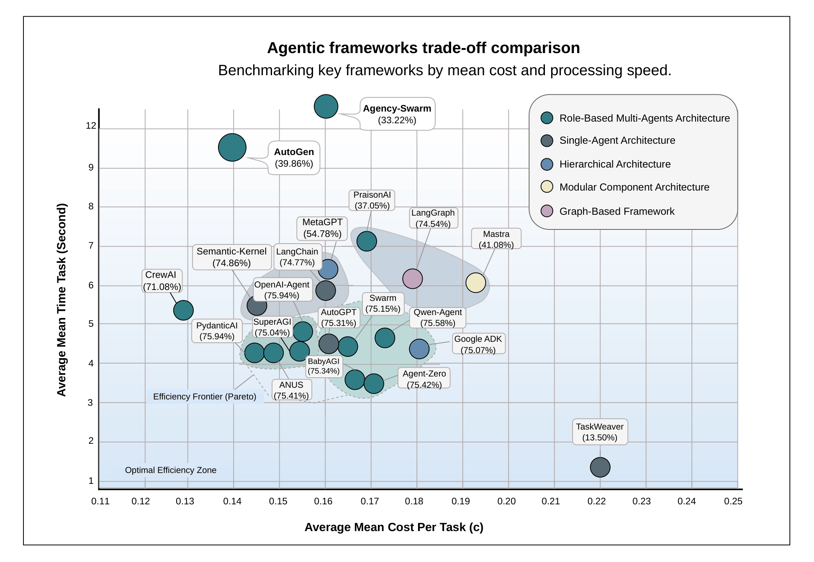

# Multi-Dataset Agentic Framework Evaluation

A benchmarking repository for evaluating multiple agentic AI frameworks across reasoning datasets. This project enables a systematic comparison of different agent architectures through a modular, configuration-driven approach, supporting multiple benchmarks including **BBH**, **GSM8K**, and **ARC**.


## Selected Agentic Frameworks for Reasoning Comparison

The following **22 agentic frameworks** were selected and implemented for reasoning-task comparison across our benchmarks.

| Framework | Status | GitHub Stars | GitHub Link | Description |
|-----------|--------|--------------|-------------|-------------|
| **AutoGPT** | ✅ Active | 182k | [AutoGPT](https://github.com/Significant-Gravitas/AutoGPT) | Autonomous agent framework focused on planning, task execution, and tool use. |
| **TaskWeaver** | ✅ Active | 6.1k | [TaskWeaver](https://github.com/microsoft/TaskWeaver) | Microsoft’s code-first agent framework for task planning and execution. |
| **Semantic-kernel** | ✅ Active | 27.4k | [Semantic-kernel](https://github.com/microsoft/semantic-kernel) | Microsoft’s AI orchestration SDK with plugins, planners, and memory support. |
| **LangChain** | ✅ Active | 110k | [LangChain](https://github.com/langchain-ai/langchain) | Popular framework for building LLM applications with chains, tools, memory, and agents. |
| **BabyAGI** | ✅ Active | 22.2k | [BabyAGI](https://github.com/yoheinakajima/babyagi) | Lightweight autonomous agent framework for task generation and execution. |
| **Autogen** | ✅ Active | 55.3k | [Autogen](https://github.com/microsoft/autogen) | Microsoft’s multi-agent conversational framework with role-based collaboration. |
| **Camel** | ✅ Active | 16.2k | [Camel](https://github.com/camel-ai/camel) | Role-playing multi-agent framework for communicative cooperation and reasoning. |
| **CrewAI** | ✅ Active | 45.5k | [CrewAI](https://github.com/crewAIInc/crewAI) | Collaborative multi-agent framework with specialized roles and workflow orchestration. |
| **SuperAGI** | ✅ Active | 17.2k | [SuperAGI](https://github.com/TransformerOptimus/SuperAGI) | Open-source autonomous agent framework with planning, memory, and tool integration. |
| **Swarm** | ✅ Active | 21.1k | [Swarm](https://github.com/openai/swarm) | Lightweight experimental multi-agent framework with agent handoff primitives. |
| **Agency-swarm** | ✅ Active | 4k | [Agency-swarm](https://github.com/VRSEN/agency-swarm) | Multi-agent orchestration framework designed around interacting specialized agents. |
| **OpenAI-Agents-Python** | ✅ Active | 19.4k | [OpenAI-Agents-Python](https://github.com/openai/openai-agents-python) | OpenAI’s Python framework for building and orchestrating agent workflows. |
| **Agent-zero** | ✅ Active | 15.9k | [Agent-zero](https://github.com/agent0ai/agent-zero) | Transparent agent framework leveraging OS-level tools and autonomous workflows. |
| **PraisonAI** | ✅ Active | 5.6k | [PraisonAI](https://github.com/MervinPraison/PraisonAI) | Production-oriented multi-agent framework with low-code and automation support. |
| **Qwen-Agent** | ✅ Active | 15.2k | [Qwen-Agent](https://github.com/QwenLM/Qwen-Agent) | Agent framework from QwenLM with tool use, RAG, and function-calling capabilities. |
| **Pydantic-AI** | ✅ Active | 15.3k | [Pydantic-AI](https://github.com/pydantic/pydantic-ai) | Type-safe agent framework emphasizing structured outputs and validation. |
| **ANUS** | ✅ Active | 6.3k | [ANUS](https://github.com/anus-dev/ANUS) | Experimental agent framework for autonomous workflows and multi-agent research. |
| **MetaGPT** | ✅ Active | 64.9k | [MetaGPT](https://github.com/FoundationAgents/MetaGPT) | Multi-agent framework inspired by software company roles and hierarchical collaboration. |
| **Google ADK** | ✅ Active | 18.2k | [Google ADK](https://github.com/google/adk-python) | Google’s Agent Development Kit for building structured agent systems. |
| **Upsonic** | ✅ Active | 7.8k | [Upsonic](https://github.com/Upsonic/Upsonic) | Agent framework focused on enterprise automation, verification, and control. |
| **Mastra** | ✅ Active | 21.8k | [Mastra](https://github.com/mastra-ai/mastra) | TypeScript-native framework for workflows, agents, and evaluation pipelines. |
| **LangGraph** | ✅ Active | 25.9k | [LangGraph](https://github.com/langchain-ai/langgraph) | Graph-based orchestration framework for stateful and controllable agent workflows. |

## Supported Datasets

The system supports multiple reasoning datasets through a modular loader architecture:

### **BIG Bench Hard (BBH)**
- **23 challenging reasoning tasks** where previous language models didn't outperform humans
- **250 test samples** per task with multi-step reasoning requirements
- **Task types**: Boolean logic, causal reasoning, temporal understanding, object tracking
- **Sample tasks**: `boolean_expressions`, `causal_judgement`, `date_understanding`, `logical_deduction_*`

### **Grade School Math 8K (GSM8K)**
- **Mathematical word problems** requiring multi-step arithmetic reasoning  
- **8,500 training samples** with natural language solutions
- **Focus**: Elementary-level math with step-by-step problem solving

### **AI2 Reasoning Challenge (ARC)**
- **Science exam questions** testing scientific reasoning
- **ARC-Easy and ARC-Challenge** subsets with varying difficulty
- **Multiple choice format** with detailed explanations
- **Focus**: Elementary and middle-school level science reasoning

## 🎯 Performance Overview

### Multi-Dataset Analysis Results

The figure below presents a trade-off comparison of the evaluated agentic frameworks. It shows the **mean accuracy across the three benchmarks** for each framework, together with the **average time per task** and **average cost per task**. This provides an overview of framework performance in terms of **accuracy, efficiency, and computational cost**.

<p align="center">
  
</p>

## Repository Structure

```
multi_dataset_benchmark/
├── run.sh               # 🚀 Interactive setup and execution script
├── pyproject.toml       # Root project dependencies (analysis tools)
├── uv.lock             # Root project dependency lock file
├── frameworks/           # Framework implementations
│   ├── utils.py         # Unified multi-dataset evaluation utilities
│   ├── datasets.yml     # Dataset configurations and specifications  
│   ├── config.yml       # Framework execution configuration
│   ├── run_config.py    # Multi-dataset configuration-based runner
│   ├── data_loaders/    # Modular dataset-specific loaders
│   │   ├── base_loader.py    # Abstract base loader interface
│   │   ├── bbh_loader.py     # Big Bench Hard loader
│   │   ├── gsm8k_loader.py   # Grade School Math 8K loader
│   │   └── arc_loader.py     # AI2 Reasoning Challenge loader
│   ├── fm_agentzero/    # AgentZero implementation
│   ├── fm_anus/         # Anus implementation
│   ├── fm_autogen/      # AutoGen implementation
│   ├── fm_camel-ai/     # CAMEL-AI implementation
│   ├── fm_crewai/       # CrewAI implementation
│   ├── fm_flowise/      # Flowise implementation
│   ├── fm_google_adk/   # Google ADK implementation
│   ├── fm_intentkit/    # IntentKit implementation
│   ├── fm_langchain/    # LangChain implementation
│   ├── fm_langgraph/    # LangGraph implementation
│   ├── fm_letta/        # Letta implementation
│   ├── fm_mastra/       # Mastra implementation
│   ├── fm_metagpt/      # MetaGPT implementation
│   ├── fm_n8n/          # n8n implementation
│   ├── fm_praisonai/    # PraisonAI implementation
│   ├── fm_pydantic/     # Pydantic implementation
│   ├── fm_qwen_agent/   # Qwen Agent implementation
│   ├── fm_semantic-kernel/ # Semantic Kernel implementation
│   ├── fm_superagi/     # SuperAGI implementation
│   ├── fm_swarm/        # Swarm implementation
│   └── fm_upsonic/      # Upsonic implementation
├── analysis/             # Analysis directory
│   ├── analysis.ipynb    # Multi-dataset analysis and visualization notebook
│   ├── detailed_results.csv # Exported detailed results
│   ├── framework_comparison.csv # Framework performance summary
│   ├── bbh_analysis.png  # BBH performance visualizations
│   ├── arc_analysis.png  # ARC performance visualizations
│   ├── gsm8k_analysis.png # GSM8K performance visualizations
│   ├── gsm8k_reasoning_analysis.png # GSM8K reasoning quality analysis
│   └── overall_comparison.png # Cross-dataset comparison heatmap
├── scripts/              # Utility scripts
│   ├── cleanup.sh        # Comprehensive project cleanup tool
│   └── run_analysis.py   # Execute analysis and launch notebook
└── README.md           # This file
```

## 🚀 Getting Started

### Prerequisites
- Python 3.9+ and `uv` package manager ([install guide](https://docs.astral.sh/uv/getting-started/installation/))
- OpenAI API key for LLM access

### 📋 Straightforward Workflow

The most reliable way to run this benchmarking system:

1. **Clone the repository:**
   ```bash
   git clone <repository-url>
   cd multi_dataset_benchmark  # or your project directory
   ```

2. **Setup your API key:**
   ```bash
   echo "OPENAI_API_KEY=your-api-key-here" > .env
   ```

3. **Clean any previous setup (optional):**
   ```bash
   ./scripts/cleanup.sh
   ```

4. **Setup all frameworks:**
   ```bash
   ./scripts/setup.sh
   ```
   
   ⚠️ **If setup fails:** The setup script logs detailed information in `logs/setup_<timestamp>.log`. If any frameworks fail to install, please [create a GitHub issue](../../issues/new) with:
   - The error message from the console
   - The full error log from the `logs/run_<date>_<time>/` directory
   - Your system information (OS, Python version, uv version)

5. **Configure evaluation (optional):**
   Edit `frameworks/config.yml` to select which frameworks and datasets to run:
   ```yaml
   datasets_to_run:
     - "bbh"      # Big Bench Hard
     - "arc"      # AI2 Reasoning Challenge  
     - "gsm8k"    # Grade School Math 8K
   
   frameworks_to_run:
     - "fm_autogen"
     - "fm_swarm"
     # ... add more frameworks as needed
   ```

6. **Run the evaluation:**
   ```bash
   ./run.sh
   ```
   This runs all frameworks and datasets configured in `frameworks/config.yml`. Logs are saved to `logs/run_<timestamp>/` for each execution.

### ⚡ Alternative Quick Demo
```bash
git clone <repository-url>
cd multi_dataset_benchmark  # or your project directory
export OPENAI_API_KEY="your-api-key-here"
./run.sh
```

The `./run.sh` script provides an interactive execution process that verifies setup completion and runs the configured evaluation.

### Manual Setup (Alternative)
```bash
git clone <repository-url>
cd multi_dataset_benchmark  # or your project directory
# Setup project and frameworks
scripts/setup.sh
# Or manual setup
uv sync                      # Setup root project
export OPENAI_API_KEY="your-api-key-here"
```

## Configuration

Edit `frameworks/config.yml` and `frameworks/datasets.yml` to customize evaluations:

**config.yml** - Framework and execution settings:
```yaml
# Select specific frameworks to run
frameworks_to_run:
  - "fm_autogen"
  - "fm_swarm"
  - "fm_crewai"

# Select datasets to run  
datasets_to_run:
  - "bbh"      # Big Bench Hard
  - "gsm8k"    # Grade School Math 8K
  - "arc"      # AI2 Reasoning Challenge

commons:
  sample_mode: true          # true: sample mode, false: full evaluation
  continue_mode: false       # true: continue from latest results
  model: "gpt-4.1-mini"      # default model

frameworks:
  fm_agentzero:
    model: "gpt-4.1-mini"    # per-framework overrides
```

**datasets.yml** - Dataset-specific configurations:
```yaml
datasets:
  bbh:
    name: "Big Bench Hard"
    modes:
      sample:
        tasks: 3             # First 3 tasks
        questions_per_task: 2 # First 2 questions per task
      full:
        tasks: -1            # All tasks
        questions_per_task: -1 # All questions
```

**Key options:** `frameworks_to_run`, `datasets_to_run`, `sample_mode`, `continue_mode`, `model` settings.

*The system uses dataset-specific loaders for optimized prompting and answer extraction for each dataset type.*

## Running Evaluations

**All frameworks:** `uv run frameworks/run_config.py`

**Specific configuration:** 
```bash
cd frameworks
uv run run_config.py --dataset bbh --mode full     # Run BBH in full mode
uv run run_config.py --config custom.yml           # Use custom config
uv run run_config.py --list-datasets               # List available datasets
```

**Individual framework:** 
```bash
cd frameworks/fm_autogen
uv run main.py --dataset=bbh [--full] [--continue] # Run with specific dataset
```

**Analysis:** View results in `analysis/analysis.ipynb` Jupyter notebook

**Project Cleanup:** `scripts/cleanup.sh` - Interactive cleanup tool with options for:
- Virtual environments, node_modules, build artifacts
- Docker containers and compose files
- Framework outputs, temporary files, logs
- Supports targeted cleanup (e.g., `./cleanup.sh . docker` for Docker cleanup only)

## 🔧 Troubleshooting

### Common Issues

**Setup failures:** If `scripts/setup.sh` fails for specific frameworks:
1. Check the detailed logs in `logs/setup_<timestamp>.log`
2. [Create a GitHub issue](../../issues/new) with the error details and log files

**Runtime failures:** If `./run.sh` fails during evaluation:
1. Check execution logs in `logs/run_<timestamp>/`
2. Each framework has individual log files showing detailed execution traces
3. Verify your OpenAI API key is correctly set in `.env`

**Missing dependencies:** If you encounter import errors:
1. Run `scripts/cleanup.sh` to clean previous installations
2. Run `scripts/setup.sh` again to reinstall dependencies
3. Check that `uv` is properly installed and accessible

### Reporting Issues

When reporting setup or runtime issues, please include:
- **Error message** from console output
- **Full log files** from the appropriate `logs/` directory
- **System information**: OS, Python version, `uv --version`
- **Steps to reproduce** the issue
- **Configuration used**: relevant parts of `config.yml` and `datasets.yml`

This helps maintainers quickly identify and resolve framework-specific issues.


## Add New Framework for Expirement

To add a new framework manually:

1. **Create framework directory**: `frameworks/fm_<framework_name>/`
2. **Implement core files**:
   - `main.py` - Main evaluation script following existing framework patterns
   - `pyproject.toml` - Dependencies and project metadata with `setup = "ready"` flag
   - `setup.sh` - Framework-specific installation script
3. **Use shared utilities**: Import and use functions from `frameworks/utils.py` for consistent evaluation
4. **Update configuration**: Add framework to `frameworks/config.yml` in the `frameworks_to_run` list
5. **Test thoroughly**:
   - Run `cd frameworks/fm_<framework_name> && ./setup.sh` for installation
   - Test with `uv run main.py` (sample mode) and `uv run main.py --full` (complete evaluation)
   - Verify output format matches `frameworks/reference_output_format.json`
6. **Optional cleanup**: Add framework to `scripts/cleanup.sh` patterns if needed

## Evaluation Methodology

- **Multi-Dataset Support**: Configurable datasets (BBH, GSM8K, ARC) with dataset-specific loaders
- **Prompting**: Configurable few-shot examples with optional chain-of-thought reasoning
- **Answer Extraction**: OpenAI API for consistent answer parsing across datasets
- **Scoring**: Exact match against ground truth labels
- **Modes**: Sample mode for development, full mode for complete evaluation
- **Modular Architecture**: Dataset-agnostic framework implementations using shared utilities

> **Note**: This benchmarking system provides a standardized way to compare how different agentic frameworks handle various reasoning challenges across multiple datasets. While individual datasets may have limitations for framework evaluation, the multi-dataset approach provides broader insights into framework capabilities across different reasoning domains.
>
> **Extensibility**: The modular loader architecture makes it easy to add new datasets beyond the current BBH, GSM8K, and ARC support. 


## Citation

```md
For further details about the experimental setup and the results of the evaluated frameworks, please refer to our paper. If you use this repository in your research, please consider citing the paper. The BibTeX entry is provided below.

```bibtex
@misc{rasheed2026agenticframeworksreasoningtasks,
      title={Agentic Frameworks for Reasoning Tasks: An Empirical Study}, 
      author={Zeeshan Rasheed and Abdul Malik Sami and Muhammad Waseem and Kai-Kristian Kemell and Mika Saari and Pekka Abrahamsson},
      year={2026},
      eprint={2604.16646},
      archivePrefix={arXiv},
      primaryClass={cs.AI},
      url={https://arxiv.org/abs/2604.16646}, 
}
